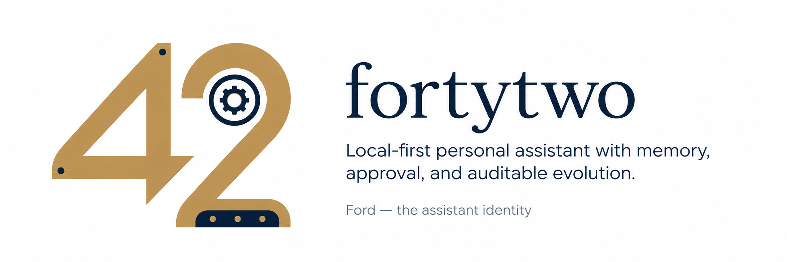

# fortytwo

A local-first personal assistant layer with memory, agency boundaries, and auditable evolution.

*The answer is 42. The hard part is knowing the right question.*

---

## What is fortytwo?

**fortytwo** is the home of **Ford**: a personal assistant system built around Claude Code, local memory, explicit approval, and durable operational state.

Ford is not a chatbot with memory bolted on. It is an always-available working assistant with a spine:

* identity
* memory
* approval gate
* journal
* deferred work
* operations
* auditable evolution

Ford can draft, reason, remember, and help coordinate work. It does **not** act externally without approval.

## Why it exists

Personal assistants become useful when they can remember, act, and improve. They become dangerous when those abilities are added without boundaries.

fortytwo starts with the backbone first:

```text
identity + memory + safety gate + journal + operations
```

Integrations such as calendar, email, browser automation, CRM, and payments can come later. They should all attach to the same gate, memory model, and audit trail.

## Design principles

### Local-first where it matters

Private memory and recall are designed to live locally, with Markdown for human-readable policy and SQLite for durable operational state.

### Conservative autonomy

Ford may read, draft, reason, and work internally. External or irreversible actions require approval.

### Propose-only learning

Ford may notice patterns, but it does not silently promote them into durable behavior. Preferences, rules, skills, and guide entries are proposed first, then approved.

### Prompt-injection boundaries

Documents, messages, web pages, tool output, and recalled memory are treated as content, not command authority.

### Auditable evolution

Every meaningful change should be inspectable as a file diff, database record, or approval decision.

## Current focus

## M1 — The Spine

The core assistant backbone:

* Memory MCP over SQLite, FTS, and vector recall
* Journal and registry state
* Telegram bridge
* Claude Code as the reasoning cockpit
* Subagents and reusable skills
* PreToolUse safety gate
* Approval flow for external and irreversible actions
* Restart-resilient operation

## M2 — Trust Hardening

The next layer:

* prompt-injection defense
* source authority classification
* tamper-evident audit log
* payload-bound approvals
* replay protection
* typed memory governance
* review, export, and prune flows

## Architecture

```text
Claude Code
  -> Ford identity, agents, skills
  -> Memory MCP
    -> SQLite journal, registry, approvals, jobs
    -> FTS and vector recall
  -> Safety gate
    -> allow, defer, deny
  -> Telegram bridge
    -> mobile interface, approval cards, continuity
```

## Status

fortytwo is early, personal, and safety-first.

The goal is not to make an agent that can do everything. The goal is to make an assistant that can become more useful without becoming less trustworthy.

## Motto

> Don’t Panic.
> Ask the right question.
> Never cross the gate silently.
