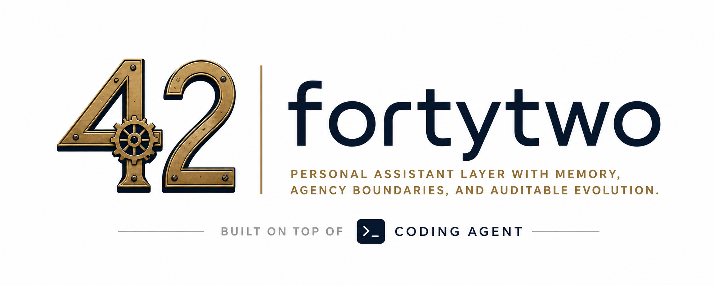

# fortytwo

A local-first personal assistant spine for the agents and tools you already use.

*The answer is 42. The hard part is knowing the right question.*

**[forty-two.it](https://forty-two.it)**

---

## What is fortytwo?

**fortytwo** is a personal assistant layer that wraps an existing agent or coding harness with memory, channels, approval gates, policy boundaries, durable jobs, and audit.

It is not trying to replace Claude Code, Codex, Pi, OpenCode, MCPs, skills, plugins, or local tools. The philosophy is:

```text
bring your own agent
bring your own tools
fortytwo supplies the personal-assistant spine
```

We are starting with Claude Code because it is the reference cockpit we use today. The core should remain portable enough to support other capable harnesses over time, hopefully with help from the community.

fortytwo is not a chatbot with memory bolted on. It is an always-available working assistant with:

* identity
* local memory
* channel access
* approval gates
* policy boundaries
* journal
* deferred jobs
* audit
* reviewable evolution

It can draft, reason, remember, and help coordinate work. It does **not** act externally without approval.

## Repositories

fortytwo is built as small, focused pieces — each its own repo, named for the role it plays. Two are designed to stand alone in **any** Claude Code setup; the rest compose into the full assistant.

| Repo | Role | Kind |
|------|------|------|
| [**gate**](https://github.com/justfortytwo/gate) | PreToolUse **safety gate** — autonomy-tier policy engine, fail-closed bash allowlist, approval hook | à-la-carte |
| [**memory**](https://github.com/justfortytwo/memory) | Semantic-**memory** MCP server (SQLite + sqlite-vec + Ollama embeddings) | à-la-carte |
| [**salience**](https://github.com/justfortytwo/salience) | Model-driven **salience extraction** for memory enrichment | engine |
| [**telegram**](https://github.com/justfortytwo/telegram) | Telegram **channel adapter** + pairing/login bridge | assistant layer |
| [**persona**](https://github.com/justfortytwo/persona) | **Persona / context** templates the installer renders | assistant layer |
| [**installer**](https://github.com/justfortytwo/installer) | `create-fortytwo` — the **installer** + lifecycle CLI | assistant layer |
| [**marketplace**](https://github.com/justfortytwo/marketplace) | Claude Code plugin **marketplace** + umbrella plugin | distribution |

Distribution is two-surfaced: a Claude Code **plugin marketplace** (skills, agents, the gate hook, MCP registration) and **npm + an installer** for the runtime engine and the non-distributable persona.

> **Status:** these are early scaffolds, actively being extracted from the working spine. The structure and cross-package contracts are in place and compile, but they are not yet published to npm or wired end-to-end. Follow along to watch the extraction land.

## Why it exists

There are already strong agents, MCP servers, plugins, skills, and local tools. The missing piece is usually not another agent from scratch. It is the personal-assistant layer around them:

```text
channels + memory + policy + approvals + jobs + audit
```

Personal assistants become useful when they can remember, act, and improve. They become dangerous when those abilities are added without boundaries.

fortytwo starts with the backbone first:

```text
identity + memory + safety gate + journal + durable jobs + operations
```

Integrations such as calendar, email, browser automation, CRM, payments, and other channel adapters can come later. They should all attach to the same gate, memory model, and audit trail.

## Design principles

### Local-first where it matters

Private memory and recall are designed to live locally, with Markdown for human-readable policy and SQLite for durable operational state.

### Bring your own agent

Claude Code is the first harness, not the permanent boundary. The goal is to make the core semantics portable across agents, models, runtimes, and tool ecosystems.

### Conservative autonomy

The assistant may read, draft, reason, and work internally. External or irreversible actions require approval.

### Propose-only learning

The assistant may notice patterns, but it does not silently promote them into durable behavior. Preferences, rules, skills, and memory entries are proposed first, then approved.

### Prompt-injection boundaries

Documents, messages, web pages, tool output, and recalled memory are treated as content, not command authority.

### Auditable evolution

Every meaningful change should be inspectable as a file diff, database record, or approval decision.

## Current state

### M1 — The Spine

The first spine is implemented around Claude Code and Telegram:

* Memory MCP over SQLite, FTS, and vector recall
* Journal and registry state
* Telegram bridge
* Claude Code as the reference cockpit
* Subagents and reusable skills
* PreToolUse safety gate
* Approval flow for external and irreversible actions
* Durable local jobs and Pulse
* Restart-resilient operation

### M2 — Trust Hardening

The hardening layer now being built:

* prompt-injection defense
* source authority classification
* content-is-not-authority runtime rules
* tamper-evident audit log
* payload-bound approvals
* replay protection
* typed memory governance
* review, export, and prune flows

### Decomposition — in progress

The working spine is being broken out of a single repo into the focused, independently-installable components listed under [Repositories](#repositories). Each carries an explicit, versioned contract (`POLICY_SCHEMA_VERSION` for the gate, `MEMORY_TOOL_CONTRACT_VERSION` for memory) so the pieces can evolve and be adopted à la carte.

### Future adapters

The project should stay open to other harnesses and channels:

* Codex
* Pi
* OpenCode
* other agent runtimes
* community MCPs, plugins, skills, and local tools

The contract matters more than the adapter: preserve provenance, classify capabilities, route risky actions through the gate, and keep durable state inspectable.

## Architecture

```text
agent / harness            (Claude Code today)
  -> persona               identity, policy, agents, skills
  -> memory                Memory MCP — SQLite journal/registry/approvals/jobs, FTS + vector recall
       +- salience         salience extraction for enrichment
  -> gate                  safety gate — allow / defer / deny
  -> telegram              Telegram bridge — mobile interface, approval cards, continuity
  -> installer             installer + lifecycle — init / doctor / update / rollback
  -> marketplace           plugin marketplace
```

## Status

fortytwo is early, personal, and safety-first.

The goal is not to make an agent that can do everything. The goal is to make existing agents useful as dependable personal assistants without making them less trustworthy.

## Motto

> Stay calm.
> Ask the right question.
> Never cross the gate silently.

---

Created and maintained by [**Enrico Deleo**](https://enricodeleo.com).
